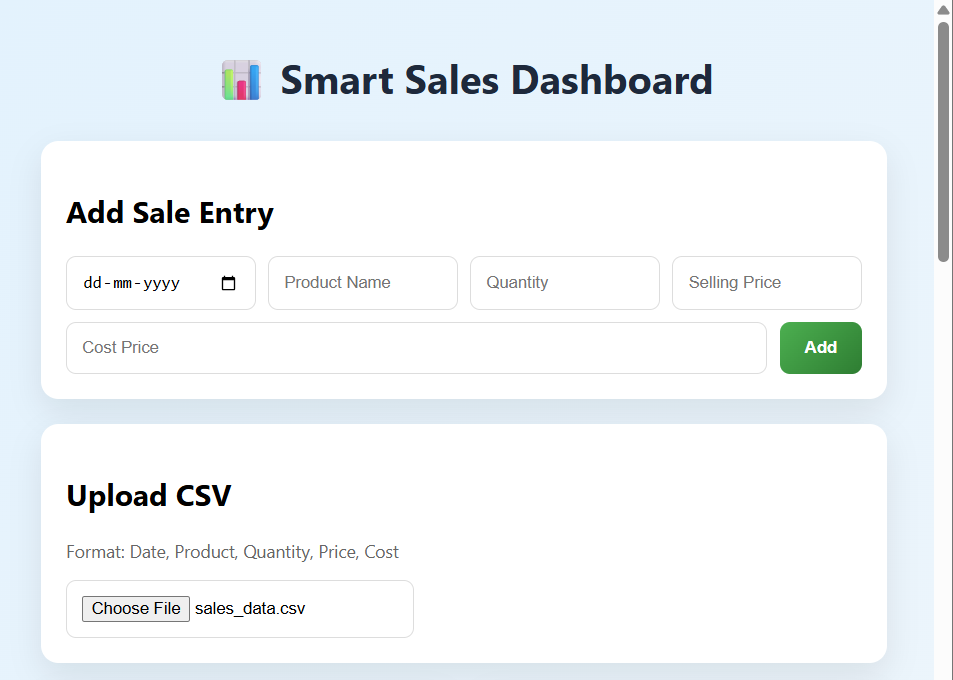
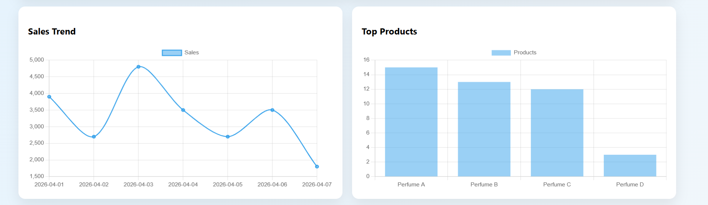
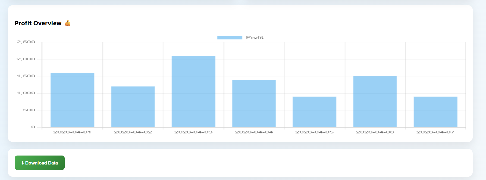
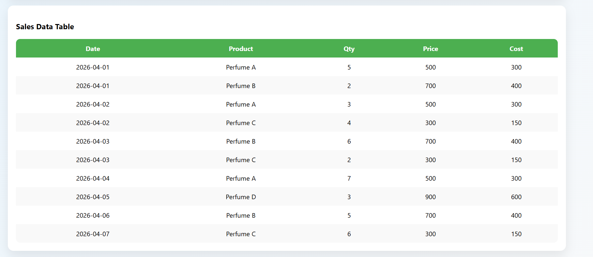
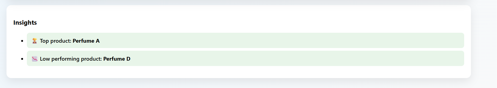

# 📊 Smart Sales Dashboard

A simple and powerful web-based Business Intelligence dashboard designed for small shop owners to analyze sales data, track profit, and gain insights.

---

## 🚀 Features

- 📁 Upload CSV sales data
- ✍️ Add manual sales entries
- 📈 Sales trend visualization (line chart)
- 📊 Product performance analysis (bar chart)
- 💰 Profit analysis graph
- 🧠 Smart insights (top & low products)
- 📋 Data table view (like Excel)
- ⬇ Download sales report (CSV)

---

## 📂 CSV Format
Date,Product,Quantity,Price,Cost
2026-04-01,Perfume A,5,500,300

---

## 🧠 How It Works

1. Upload CSV or enter data manually
2. Data is processed in browser using JavaScript
3. Charts are generated using Chart.js
4. Insights are calculated using simple logic

---

## 🛠 Tech Stack

- HTML
- CSS
- JavaScript
- Chart.js

---

## 🎯 Purpose

This project is built for:
- Learning data visualization
- Helping small businesses track sales
- Demonstrating basic analytics skills

---

## 🌐 Live Demo

https://smart-sales-dashboard-sai.netlify.app/

---

## 📸 Screenshot

---

## 👨‍💻 Author

Eraf Ali

---

## 📌 Future Improvements

- Add login system
- Add database storage
- Advanced AI-based predictions
- Mobile app version